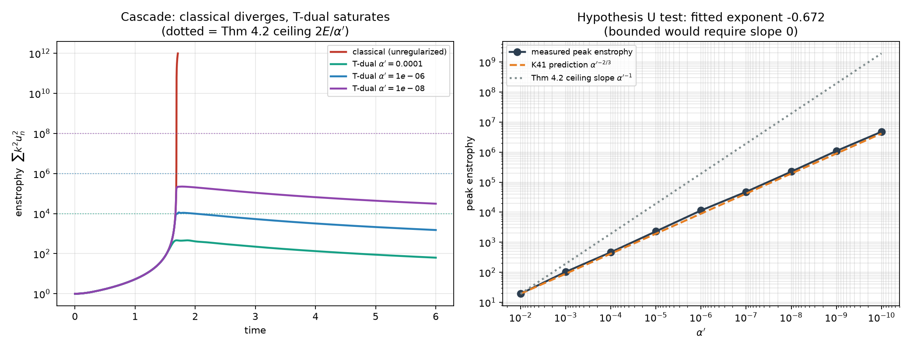

# SOCRATES

**Dual-Scale Topological Geometry and the Regularization of Singular Cascades**
*Computational companion to the Socrate AI Lab programme on Navier–Stokes global regularity.*

This repository is the **Tier B layer** of the programme described in
`paper/` — the exact-arithmetic and numerical-experiment counterpart to the
Lean 4 kernel certificates (Tier A). Every claim here is decided by computation:
exact `Fraction` arithmetic where the question is algebraic, controlled
numerics with explicit error oracles where it is dynamical.

> **Headline result (control arm).** The shell-model analogue of Hypothesis U **fails**
> in the bare (non-Sym²-coupled) model, with peak enstrophy diverging as $\alpha'^{-0.672}$ —
> Kolmogorov's $-2/3$ to within 0.7%. This establishes the baseline the Sym² lock
> must beat. See [docs/FINDINGS.md](docs/FINDINGS.md) and bilingual reports in `reports/`.
>
> **Latest achievement (`release-1` tag, 2026-08-12) — partial repair, adversarially checked.**
> The first attempt to measure the Sym²-locked model came back honestly
> inconclusive — 0/9 sweep runs met the convergence gate (FINDINGS §6). The repair
> attempt found and fixed two real bugs — a genuine coordinate branch point in the
> model's chart, and a spurious local minimum in the model-fitting step — both
> **confirmed independently**. But its headline claim ("4th-order convergence, fully
> repaired") was **refuted** by the very next adversarial-verification step: the
> timestep rule itself still makes drift an erratic, sign-flipping function of cfl
> at the flagship configuration, and the pinning test only passed because it
> exercised a smaller, non-representative case. See
> [FINDINGS §7](docs/FINDINGS.md) for the full, honest account — this is exactly
> what the adversarial-verification stage exists to catch, and it worked. Round 2
> continues once the step rule is genuinely fixed. See
> [Roadmap](#vision-approach-and-roadmap) below.

---

## Vision, approach, and roadmap

**Vision.** Decide, by computation and kernel-checked proof rather than
prose, whether a dual-scale T-dual metric plus a symmetric-square coupling
lock can regularize the Navier–Stokes energy cascade — turning Hypothesis U
and Conjecture 5.2 from claims in a paper into either a proof obligation
Lean can discharge, or a falsified conjecture with the falsifying measurement
on record. Either outcome is a real result; a plausible-sounding paper with
no computational spine is not the goal here.

**Approach.** Three disciplines, applied without exception:

1. **The tier system.** Tier A (Lean kernel-checked) > Tier B (exact
   computation / controlled numerics with error oracles) > Tier C (labelled
   conjecture, never load-bearing). A claim moves up a tier only when its own
   check passes — see the epistemic table below.
2. **The validation ladder.** No solver is trusted near a frontier problem
   until it has climbed known-answer rungs first — see
   [`scripts/solver_ladder.py`](scripts/solver_ladder.py). Same discipline
   applies to the workflow processes themselves, below.
3. **Adversarial, tier-routed workflow orchestration for decisive
   experiments.** A measurement the programme will act on is never taken at
   face value from a single pass: design/repair steps go to the most capable
   model tier, get independently re-verified by a skeptic whose default is
   to refute, and a genuinely inconclusive result is written up as a finding,
   not smoothed into a number. The pattern is documented as a reusable skill
   at [`.claude/skills/decisive-experiment/SKILL.md`](.claude/skills/decisive-experiment/SKILL.md)
   and the routing table lives in
   [`docs/IMPLEMENTATION_PLAN.md`](docs/IMPLEMENTATION_PLAN.md). Round 1 of
   the current decisive experiment (W1) is the reason this discipline exists
   in writing: a naive sweep-then-report pass would have missed that its own
   test suite was green only because it never exercised the failing window.

**Roadmap** (workflows W1–W4, full detail in
[`docs/IMPLEMENTATION_PLAN.md`](docs/IMPLEMENTATION_PLAN.md)):

| Workflow | Goal | Status |
|---|---|---|
| **W1** | Does the Sym² lock change the Hypothesis-U exponent from $-2/3$? The decisive experiment. | Round 1: contract + implementation done, sweep inconclusive (gates caught a real defect). Round 2 phase 1: chart branch-point fixed and confirmed; step-rule fix refuted by adversarial verification (FINDINGS §7) — real work remains before the separation measurement can run. |
| **W2** | Solver-ladder maintenance and extension — new rungs (restricted three-body, Mercury perihelion 1PN, more Horizons targets) never edit an old rung's gate. | Not started. |
| **W3** | EIU / exact-arithmetic layer — an exact-mode path for every solver with rational forces, bit-growth economics measured en route to an RNS-backed dot-product kernel. | Not started. |
| **W4** | Paper, Lean development, and this repository state the same theorems. | Partial — `lean/CallensDualScale.lean` received and checked (3 theorems, 1 proof fixed), but the full original paper source with LEAN-tagged theorem statements has not been supplied, so the checklist can't be completed exhaustively yet. |

---

## The three-tier epistemic system

| Tier | Meaning | Where it lives |
|---|---|---|
| **A** — established | Kernel-checked in Lean 4, or classical results with references | `paper/`, Lean development |
| **B** — checkable | Decided by exact computation; no floating point in algebraic claims | **this repository** |
| **C** — conjecture | Physical or mathematical proposals, always labelled, never load-bearing | `docs/FINDINGS.md` §4 |

The design rule inherited from the paper: **regularization is never an axiom.**
An early Lean axiomatization derived `False` through a division-by-zero edge
case. Accordingly `effective_radius(alpha, 0)` **raises** rather than returning
a convention value — the same discipline, enforced in Python.

---

## What has been computationally established

### ✅ Confirmed

- **Theorems 2.2–2.4** (T-dual bound, bounce, inertial invisibility) — exact
  rational arithmetic over radii spanning both sides of the cutoff, so neither
  branch passes vacuously.
- **Theorem 3.1** (discrete Sym² lock) — certified on squares *and cross
  products* of independent solutions, including degenerate $a=0$, $b=0$.
  Constructed root-free from elementary symmetric functions of
  $\{\lambda^2,\lambda\mu,\mu^2\}$, so it holds for irrational and complex roots.
- **Apéry sequences** — $\zeta(3)$: 1, 5, 73, 1445, 33001, 819005;
  $\zeta(2)$: 1, 3, 19, 147, 1251, 11253. Integrality preserved.

### 🅰️ Tier A — Lean 4 kernel-verified

`lean/CallensDualScale.lean` (Lean 4.32.2 + Mathlib; `cd lean && lake build
CallensDualScale`) — three theorems, all kernel-checked with no `sorry` and no
axioms beyond the one declared ($\alpha' > 0$) plus Lean's standard
foundational axioms (verified via `#print axioms`, see
[docs/FINDINGS.md §2b](docs/FINDINGS.md)):

- `genesis_no_singularity` — $R_{\text{eff}}(\alpha',R) > 0$ for all $R>0$.
- `Reff_ge_sqrt` — $R_{\text{eff}}(\alpha',R) \ge \sqrt{\alpha'}$. **As
  received this proof did not compile** (four type-mismatch errors); fixed
  and now green — see FINDINGS for the diff.
- `sym2_recurrence` — the squares-case closed form of the Sym² lock,
  independently matching the Python `closed_form_symmetric_square()`
  coefficients exactly. Two independent methods (kernel proof, exact-rational
  computation) agree.

T-duality invariance and inertial invisibility (Theorems 2.3–2.4) remain
**Tier B only** — no Lean statement of either has been located yet.

### ⚠️ Correction required

**Theorem 2.5 as written in the draft is false.** The paper states
$\alpha'/R_{\text{eff}}(\alpha',\alpha'/R) = R_{\text{eff}}(\alpha',R)$.
With $\alpha'=1/4$, $R=1000$ the left side is $1/4000$ and the right is $1000$.
The correct statement is plain invariance,
$R_{\text{eff}}(\alpha',\alpha'/R) = R_{\text{eff}}(\alpha',R)$ — which is both
true and what the physics requires. Pinned as a regression test.

### 📉 Main finding — Hypothesis U fails in the bare shell model

Peak enstrophy over eight decades of $\alpha'$, all runs converged with energy
drift $\approx 1.3\times10^{-7}$:

$$\Omega_{\text{peak}} \sim \alpha'^{-0.672}$$

Hypothesis U requires exponent **0**. The measured exponent is Kolmogorov's
$-2/3$: with $E(k)\sim k^{-5/3}$ and cutoff $k_{\max}=1/\sqrt{\alpha'}$,
$\Omega \sim k_{\max}^{4/3} = \alpha'^{-2/3}$.



**This is a control result, not a refutation.** The plain Katz–Pavlović model has
*no* Sym² structure — and Conjecture 5.2 attributes the hoped-for bound
specifically to the symmetric-square lock. So this measurement establishes
$-2/3$ as the number the mechanism must beat, making the next experiment sharp
and falsifiable in either direction.

### 🔧 W1 round 2, phase 1 — the Sym²-locked stepper: partial repair, adversarially refuted

The first attempt to measure the locked model (`src/socrates/dualscale/shell_sym2.py`)
came back with **no valid exponent**: 0 of 9 sweep runs met the convergence
gate, because the energy-conservation oracle itself was broken at the full
integration window (`docs/FINDINGS.md` §6). The repair step found a genuine
**branch point** at $a=0$ in the model's $(a,b)$ chart (the map
$(a,b)\mapsto L_3$ is a 2:1 branched cover) and fixed it by reformulating to
the honest 1:1 gauge $A=a^2$ — **confirmed independently**: the reduced
field is unchanged between charts to $10^{-14}$–$10^{-16}$, and a second,
unrelated bug (a spurious local minimum in the model-fitting step) was also
found and fixed, confirmed to residual $3.4\times10^{-17}$.

**But the headline claim — full-window 4th-order convergence, gates never
loosened — was refuted** by the next step in the pipeline: an independent
skeptic tasked explicitly with trying to break it. A fixed-timestep control
on the *identical* repaired field is clean and monotone; the *shipped*
adaptive rule on the same field is not — spread $379.7\times$ with ~10 sign
flips over the same range, including one halving *printed in the original
report's own table* that makes drift $1.2\times$ **worse**. The pinning
regression test passes only because it exercises $N=6$, not the $N=24$
configuration the claim is about — applying the test's own criterion at
$N=24$ fails. Full account, including everything that *did* survive
independent re-verification, in [FINDINGS §7](docs/FINDINGS.md).

**This is exactly what the adversarial-verification stage
(`.claude/skills/decisive-experiment/SKILL.md`) exists to catch, and it
worked** — a plausible, well-evidenced, honestly-written single-agent
report still needed independent re-derivation from scratch before being
trusted. Round 2 continues once the step rule itself (separable from the
now-confirmed chart fix) is genuinely repaired. See the Roadmap above.

---

## The solver and the validation ladder

`socrates.solvers` provides symplectic (leapfrog/KDK) integration in two modes:
float (with conservation oracles) and **exact rational** (the EIU mode — the
integrator map applied in `Fraction` arithmetic, where time-reversal recovers
the initial state as *exact equality*, not epsilon). `socrates.eiu` models the
HaloAlg Exact Inference Unit: RNS parallel arithmetic with CRT reconstruction,
overflow discipline, and the honest form of the state-collapse error bound.

`scripts/solver_ladder.py` climbs problems of increasing complexity, each
gated on an independent oracle before the next unlocks:

| Rung | Problem | Oracle | Result |
|---|---|---|---|
| 1 | Harmonic oscillator | analytic cos(t); measured order 2.000 | ✅ err 2.6e-6 |
| 2 | Nonlinear pendulum | exact elliptic period 4K(m) | ✅ err 2.0e-8 |
| 3 | Kepler two-body (e=0.6) | E, L conservation + Kepler III | ✅ L drift 2e-14 |
| 4 | **Mars vs JPL Horizons** | real open ephemeris, 182 days | ✅ RMS 3.6e-5 |
| 5 | Dyadic cascade | Stage 1 controls + Thm 4.2 ceiling | ✅ |

Two more spec claims were corrected by gates failing (see
[paper/REVIEW_haloalg.md](paper/REVIEW_haloalg.md)): the HaloAlg Diophantine
bound ε < 1/(q·D_max) is false (measured violation ×2; the correct
Farey-neighbour bound 1/(q·(N+1−q)) is implemented and property-tested), and
"GCD reduction bounds bit-width" is not a theorem — exact-mode bit-width grows
without bound (134→799 bits in 60 steps) unless a *lossy* collapse is admitted.

The smooth HoloAlg metric R + α'/R is implemented alongside the max-form, with
a **no-go lemma**: exact T-duality plus exact inertial invisibility force the
non-smooth max-form uniquely, so any smooth metric must trade exact
invisibility for asymptotic (deviation α'/R). Certified exactly.

---

## Methodological warning (please read before citing Stage 1)

**A fixed-timestep explicit integration cannot support the blow-up claim.** With
$k_n=2^n$ over 35 shells, $k_{\max}\approx1.7\times10^{10}$; an explicit step of
$10^{-5}$ violates stability by five orders of magnitude. The classical run then
diverges *numerically*, indistinguishable by eye from physical blow-up — and the
error biases *toward* the thesis, since T-dual regularization caps
$k_{\text{eff}}\le1/\sqrt{\alpha'}$ and thereby incidentally stabilizes the
regularized run.

Controls used here instead:
- adaptive RK4, $\Delta t = \mathrm{cfl}/\max_n(k_n|u_n|)$
- **energy conservation as an independent oracle** (the inviscid nonlinearity
  telescopes, so $dE/dt=0$ exactly) — drift falls $2.4\times10^{-3}\to1.3\times10^{-7}$
  under refinement
- explicit termination reasons: `t_max`, `dt_collapse`, `max_steps`

---

## Installation

Requires Python ≥ 3.11 and a Rust toolchain ([rustup.rs](https://rustup.rs)).

```bash
make setup      # venv + Python deps + compile the Rust extension
make test       # pytest (offline) + cargo test
make lint       # ruff + clippy
```

Or manually:

```bash
uv venv && uv pip install -e ".[dev,notebooks]"
uv run maturin develop --release -m rust/socrates_numerics/Cargo.toml
```

---

## Usage

### Tier B certificates — the paper's theorems, checked exactly

```python
from fractions import Fraction
from socrates.dualscale import certify_geometry
from socrates.operators import RecurrenceOperator, verify_symmetric_square

certify_geometry(Fraction(1, 4))       # Theorems 2.2–2.5, exact rationals
verify_symmetric_square(RecurrenceOperator.of(1, 1))   # Theorem 3.1
```

### Stage 1 — the dyadic laboratory

```bash
python scripts/experiment_stage1.py    # controls + Hypothesis U scaling + figure
```

```python
from socrates.dualscale import compare_regularization

runs = compare_regularization(n_shells=24, alpha_prime=1e-6, t_max=6.0)
runs["classical"].terminated   # 'max_steps' — never reaches t_max
runs["tdual"].terminated       # 't_max'     — completes, enstrophy saturates
runs["tdual"].energy_drift     # ~1e-7 — integration is trustworthy
```

### Exact algebra — the twisted cubic

```python
from fractions import Fraction
from socrates.core import Polynomial, groebner_basis

# I = <x² − y, x³ − z>, lexicographic order
f1 = Polynomial({(2, 0, 0): Fraction(1), (0, 1, 0): Fraction(-1)}, 3, "lex")
f2 = Polynomial({(3, 0, 0): Fraction(1), (0, 0, 1): Fraction(-1)}, 3, "lex")

for g in groebner_basis([f1, f2], "lex"):
    print(g)
# x0^2 - x1
# x0*x1 - x2
# x0*x2 - x1^2
# x1^3 - x2^2
```

### Algebra → topology

```python
from socrates.core import sample_variety, torus_polynomial
from socrates.tda import vietoris_rips

points = sample_variety([torus_polynomial()], 400, bounds=(-3.5, 3.5), seed=0)
diagram = vietoris_rips(points, max_dimension=2)
print(diagram.betti_numbers(0.9))   # → [1, 2, 1], the torus
```

### The cosmic web

```python
from socrates.cosmos import fetch_galaxies, to_comoving_cartesian, analyze_cosmic_web

sample = fetch_galaxies(limit=20_000, zmin=0.01, zmax=0.10)   # cached after first call
points = to_comoving_cartesian(sample)                        # (ra, dec, z) → Mpc
topology = analyze_cosmic_web(points, max_dimension=2)

print(topology.summary())
# {'n_galaxies': 20000, 'structure_counts': {'clusters': ..., 'filament_loops': ...,
#  'voids': ...}, 'void_scale_mpc': ..., 'H1_entropy': ...}
```

---

## Data sources

All datasets are public. Cite them in any derived work — see
[docs/REFERENCES.md](docs/REFERENCES.md).

| Domain | Dataset | Access |
|---|---|---|
| Astrophysics | SDSS DR17 `SpecObj` | `astroquery.sdss`, cached to `data/` |
| Genetics | NCBI GenBank mtDNA alignments | planned — `dendropy` + Entrez |
| String theory | Kreuzer–Skarke reflexive polytopes | planned — via CYTools |

`data/` is gitignored. Fetches are content-hashed and cached; nothing is
re-downloaded unnecessarily.

---

## Testing

```bash
make test        # offline unit tests + Rust tests
make test-all    # includes network-marked SDSS integration tests
make bench       # Rust vs NumPy kernel benchmarks
```

Tests marked `network` are excluded from CI. Correctness is anchored on
**known-answer tests**, not self-consistency: textbook Gröbner bases
cross-validated against SymPy, and Betti numbers of manifolds whose homology is
known analytically.

---

## License

MIT — see [LICENSE](LICENSE).
